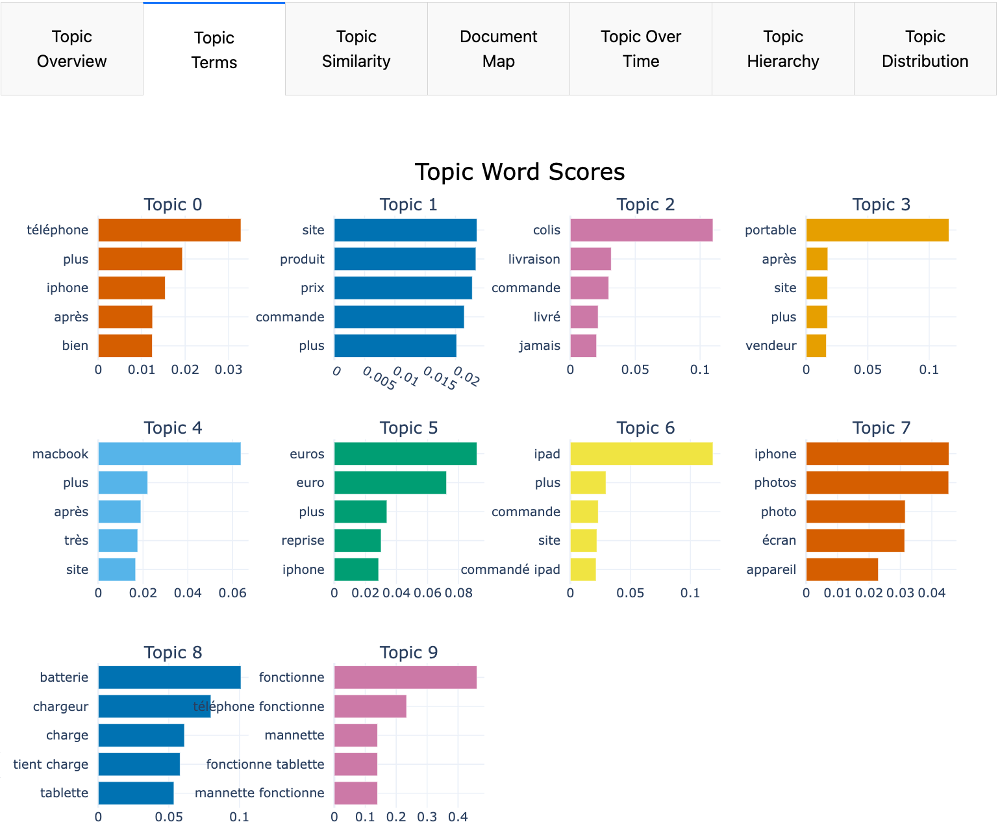

# **BERTopic Customer Review Topic Modeling**

## **Overview**
This project uses **BERTopic**, a powerful topic modeling library, to analyze customer reviews and extract meaningful topics. The pipeline is designed to be modular, scalable, and easy to integrate into an ETL (Extract, Transform, Load) pipeline. It includes:

- **Data Loading**: Preprocessing raw customer review data.
- **Topic Modeling**: Training a BERTopic model to identify topics in the reviews.
- **Evaluation**: Calculating coherence scores and topic diversity metrics to evaluate model performance.
- **Visualization**: Providing an interactive dashboard to explore topics, their distributions, and related documents.
- **Docker Integration**: Packaging the application into a Docker container for seamless deployment in production environments.

---

## **Features**
1. **BERTopic Model**:
   - Utilizes transformers for embeddings, UMAP for dimensionality reduction, and HDBSCAN for clustering.
   - Configurable parameters via a YAML configuration file.

2. **Interactive Dashboard**:
   - Built using **Dash** and **Plotly** for visualizing topics, topic distributions, and sample documents.
   - Includes tabs for:
     - Topic overview
     - Document map (2D visualization of topics)
     - Topic hierarchy
     - Top terms per topic
     - Topic distribution

3. **Model Evaluation**:
   - Computes coherence scores using Gensim's CoherenceModel.
   - Calculates topic diversity to measure the uniqueness of topics.

4. **Docker Support**:
   - The application is containerized for easy deployment at the end of an ETL pipeline.

---

## **Project Structure**
The project is organized as follows:

```
├── main.py                  # Main script to run the pipeline
├── Dockerfile               # Docker configuration for containerization
├── requirements.txt         # Python dependencies
├── config.yaml              # Configuration file for pipeline parameters
├── data/                    # Directory for input/output data
│   ├── full/                # Raw customer reviews (CSV files)
│   └── results/             # Output directory for model artifacts
└── README.md                # Project documentation
```

---

## **Dashboard Screenshots**
Below are some screenshots of the interactive dashboard generated by the pipeline. These visuals provide insights into the topics extracted from customer reviews and their relationships.

### **1. Topic Overview**
This tab provides a high-level summary of the identified topics, including their sizes and names.


### **2. Document Map**
A 2D visualization of the topics and their associated documents. Each point represents a document, colored by its assigned topic.


### **3. Topic Hierarchy**
A hierarchical representation of the topics, showing how they are grouped and related to each other.


### **4. Top Terms Per Topic**
A bar chart displaying the top terms for each topic, highlighting the most representative words.



### **5. Topic Distribution**
A distribution plot showing the probability distribution of topics across the dataset.


---

## **Configuration**
The pipeline is configured using a YAML file (`config.yaml`). Below is an example configuration:

```yaml
data:
  input_filepath: "data/full/reviews.csv"  # Path to the input CSV file
  review_column: "review"                 # Column containing review texts
  sample_size: null                       # Optional: Number of reviews to sample

model:
  transformer_name: "sentence-transformers/all-MiniLM-L6-v2"
  umap:
    n_neighbors: 15
    n_components: 5
    min_dist: 0.0
    metric: "cosine"
  hdbscan:
    min_cluster_size: 15
    metric: "euclidean"
    cluster_selection_method: "eom"
  vectorizer:
    ngram_range: [1, 2]
  min_topic_size: 10
  language: "english"
  nr_topics: "auto"

evaluation:
  sample_size: 1000                       # Number of documents for coherence calculation
  coherence_metrics: ["c_v", "u_mass"]   # Coherence metrics to calculate

output:
  output_dir: "data/output"             # Directory to save model outputs
  save_model: true                       # Whether to save the trained model
  dashboard_port: 8050                   # Port for the Dash dashboard
```

---

## **Usage**

### **1. Prerequisites**
- Python 3.8 or higher
- Docker (for containerization)

Install the required dependencies:
```bash
pip install -r requirements.txt
```

### **2. Running the Pipeline**
To run the pipeline locally, execute the following command:
```bash
python main.py --config config.yaml
```

This will:
1. Load and preprocess the customer reviews.
2. Train the BERTopic model.
3. Evaluate the model using coherence and diversity metrics.
4. Save the trained model and outputs to the specified directory.
5. Launch the interactive Dash dashboard.

### **3. Accessing the Dashboard**
Once the pipeline is running, the dashboard will be accessible at:
```
http://localhost:8050
```

### **4. Docker Deployment**
To deploy the application using Docker:

#### **Step 1: Build the Docker Image**
```bash
docker build -t bertopic-container .
```

#### **Step 2: Run the Container**
```bash
docker run -p 8051:8050 \
           -v "$PWD/data/full:/data/full" \
           -v "$PWD/data/output:/data/output" \
           -v "$PWD:/app" \
           bertopic-container python /app/main.py
```

Access the dashboard at:
```
http://localhost:8051
```

---

## **Evaluation Metrics**
The pipeline evaluates the topic model using the following metrics:
1. **Coherence Scores**:
   - Measures the interpretability of topics.
   - Supported metrics: `c_v`, `u_mass`, `c_uci`, `c_npmi`.

2. **Topic Diversity**:
   - Measures the uniqueness of topics by calculating the ratio of unique words to total words across all topics.

---

## **Contributing**
Contributions are welcome! Please follow these steps:
1. Fork the repository.
2. Create a new branch for your feature or bugfix.
3. Submit a pull request with a detailed description of your changes.

---

## **License**
This project is licensed under the **MIT License**. See the `LICENSE` file for details.

---

## **Contact**
For questions or feedback, please contact:
- Email: [your-email@example.com]
- GitHub: [your-github-username]
```

---

### Instructions for Adding Images
1. **Save Your Screenshots**:
   - Take screenshots of your dashboard and save them in a folder named `assets` within your repository (e.g., `assets/topic_overview.png`).

2. **Reference Images in Markdown**:
   - Use the Markdown image syntax to embed the images:
     ```markdown
     
     ```
   - For example:
     ```markdown
     
     ```

3. **Commit and Push Changes**:
   - Add the `assets` folder and the updated `README.md` to your Git repository:
     ```bash
     git add assets README.md
     git commit -m "Add dashboard screenshots to README"
     git push
     ```

By following these steps, you'll have a visually appealing `README.md` that effectively showcases your dashboard's capabilities.